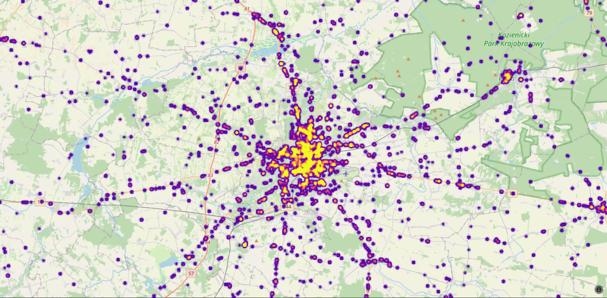

# car-accidents

## Python - Django based project to provide car accidents visualisation.  
### The rate of car accidents has increased to a large number over last few years. Therefore, knowledge about  
### danger of road accidents is crucial for all drivers and pedestrians. We decided to create a project showing  
### where and how often accidents happen. 
#  Team Members
|Name|Email|     
|----|-----|   
|Krzysztof|krzysiek@email.com|
|Wojtek|wojtek@email.com|
|Michał|michal.malek1@gmail.com|

# License
The MIT License (MIT)
Copyright © 2021 <Wojtek> 

Permission is hereby granted, free of charge, to any person obtaining a copy of this software and associated   
documentation files (the “Software”), to deal in the Software without restriction, including without limitation the  
rights to use, copy, modify, merge, publish, distribute, sublicense, and/or sell copies of the Software, and to permit   
persons to whom the Software is furnished to do so, subject to the following conditions:

The above copyright notice and this permission notice shall be included in all copies or substantial portions of  
the Software.

THE SOFTWARE IS PROVIDED “AS IS”, WITHOUT WARRANTY OF ANY KIND, EXPRESS OR IMPLIED, INCLUDING BUT NOT LIMITED TO  
THE WARRANTIES OF MERCHANTABILITY, FITNESS FOR A PARTICULAR PURPOSE AND NONINFRINGEMENT. IN NO EVENT SHALL  
THE AUTHORS OR COPYRIGHT HOLDERS BE LIABLE FOR ANY CLAIM, DAMAGES OR OTHER LIABILITY, WHETHER IN AN ACTION  
OF CONTRACT, TORT OR OTHERWISE, ARISING FROM, OUT OF OR IN CONNECTION WITH THE SOFTWARE OR THE USE OR OTHER DEALINGS  
IN THE SOFTWARE. 

